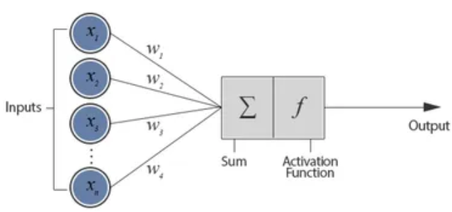

# 퍼셉트론 (Perceptron)
- 퍼셉트론은 논리 게이트를 모방할 수 있는 인공 신경망의 한 종류이다.
- **가중치와 편향**을 통해 논리 게이트와 같은 동작을 한다.
- 머신러닝과 유사

# 활성화 함수
- 입력값(x)에 가중치(w)와 절편(bias)을 관련지어서 나온 총합을 출력 신호로 변환해주는 함수
    - 시그모이드
    - 계단
    - ReLU
    - Leaky
    - tanh

# 딥러닝을 통한 다차원 배열 계산
- 다차원 배열을 행렬(Matrix) 또는 텐서(Tensor)라는 용어 사용
- **행렬의 내적(np.dot)**은 딥러닝 신경망에서 중요한 연산
    - (m×n) 행렬과 (n×p) 행렬을 곱하면 (m×p) 크기의 행렬이 생성
    - (m×n) 행렬과 (n×p) 행렬을 곱할려면 첫번째 텐서의 열과 두번째 텐서의 행이 숫자가 같아야 한다.
    
- 내적 연산을 통해 텐서의 합을 구하고 활성화 함수를 적용시키는것이 기본 원칙
```python
X = np.random.randn(6,10)

# 은닉층 : 10개의 입력 -> 8개의 뉴런
W1 = np.random.randn(10,8)
b1 = np.random.randn(1,8)

# 출력층 : 8개의 입력 -> 4개의 클래스
W2 = np.random.randn(8,4)
b2 = np.random.randn(1,4)

#은닉층 계산 (선형 계산 + tanh 활성화 함수)
z1 = np.tanh(np.dot(X,W1)) + b1

# 출력층 계산 (선형 계산 + softmax 활성화 함수)
z2 = np.dot(z1, W2) + b2
exp_z = np.exp(z2 - np.max(z2, axis=1, keepdims=True))
result = exp_z/np.sum(exp_z, axis=1, keepdims=True)
print(result)
```

# 출력층 설계
- 출력층 활성화 함수
    - 항등함수
    - 시그모이드 함수
        - 이진 분류 (0,1)
    - 소프트맥스 함수
        - 다중 분류
        - 오버플로우 발생 가능성 있음
            - 이를 막기 위해 <code>np.exp(x-np.max(x))/ np.sum(np.exp(x-np.max(x)))</code>이런식으로 **x의 최대값을 빼서** 사용한다.
    - 이 세가지를 주로 사용하고 그 이유는
        1. 문제 유형에 최적화
        2. 미분 가능성 및 학습의 안정성
            - **역전파 알고리즘에 적합**
        3. 수학적 실무적 검증
- 출력층의 뉴런 수
    - 회귀 문제 : 1개
    - 이진 분류 1개 또는 2개
    - 다중 클래스 분류 : 클래스 개수와 동일한 뉴런 개수